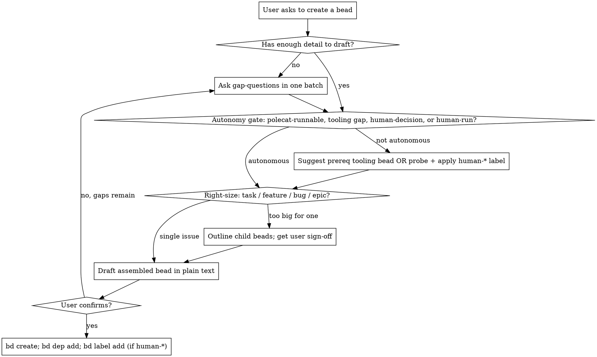

# Authoring Beads

## Overview

A bead an agent runs is a contract. The agent has only the title, description, acceptance criteria, design, and notes — plus the codebase. Bad beads produce sloppy, off-target, or hallucinated work. Good beads produce focused, verifiable changes.

Use this skill to *partner with the user* to elicit a bead an agent can execute well. Skip it for one-shot follow-ups discovered mid-task with clear scope — those can use a tight `bd create` directly.

## Core principle

**Ask first. Draft second. Create third.**

A one-line user request is rarely sufficient. Drafting from it anchors the user to your assumptions and any details you fabricated. Always elicit the gaps *before* you draft.

## When to use vs skip

| Use this skill | Skip it |
|---|---|
| User says "make a bead for X" and X isn't fully specified | Follow-up bug discovered mid-task with clear repro |
| Multi-step or multi-file feature | Trivial cleanup ("fix typo in README") |
| Bug with vague repro | Bug whose reproduction is already in hand |
| Anything destined for autonomous-agent execution | Note-to-self placeholders the user will refine |

## The flow



## Gap questions — pick only what you don't already have

Never blast the whole list. Skip anything the user already gave you or that's plainly readable from the codebase.

**Why and outcome**
- What changes for users / the system once this ships?
- What does success look like — what should be true that isn't true now?

**Scope and bounds**
- What's explicitly out of scope?
- One issue, or several behind one outcome?

**Where the agent looks**
- What part of the code does this touch — file, module, or symbol?
- How does an agent verify this? (test command, manual check, reviewer)

**Reproduction (bugs only)**
- How do I reproduce it? (env, account, state, browser)
- What's the symptom? (error, wrong result, slow, hang)
- How often — every time, intermittent, only X% of users?

**Risk and dependencies**
- Anything that blocks this, or that this should block?
- Anything this should *not* change?

If an answer is unknowable now, capture it as an open question in `--notes`, not as a guess in acceptance criteria.

## Autonomy-first authoring

Default: every bead is **polecat-runnable** — an autonomous agent picks it from `bd ready`, executes it end-to-end, and closes it without a human in the loop. Anything that breaks the default needs a confirmed reason.

### The autonomy gate

Once gap-questions are answered, classify the bead before drafting:

- **(a) Polecat-runnable** — agent has the codebase plus the project's existing tooling to finish it. Default. No label.
- **(b) Tooling gap** — a capability that *could* exist but doesn't yet (missing MCP server, missing `.claude/settings.json` allow rule, missing `AUTOCONFIRM`-style env-var flag on a script, missing polecat instruction file, script that needs an unattended-mode wrapper). → Surface a prereq tooling bead *before* filing the original.
- **(c) Human-decision** — a choice that needs human authority or context an agent can't derive (scope approval, library/threshold/SLO selection, vendor or legal sign-off). → Apply label `human-decision`.
- **(d) Human-run** — a step that needs human hands or accounts (UI click-through, in-person meeting, IT ticket, manual portal approval, hardware action). → Apply label `human-run`.

Default to (a). Most "needs a human" gut reactions turn into (b) once you ask "what tooling would unblock this?"

### Labels — apply with `bd label add`

```bash
# After bd create, only if the bead is NOT polecat-runnable:
bd label add <id> human-decision
bd label add <id> human-run
```

Labels are first-class and queryable: `bd list --label human-decision` pulls the human-blocked queue; `bd list --exclude-label human-decision,human-run` is the polecat fleet's natural filter.

### Probe ONCE before applying a human-* label

Before stamping `human-decision` or `human-run`, probe the user exactly once:

> "I'm about to label this `human-run` because <reason>. Is there tooling that would let an agent do this instead — an MCP server, a `.claude/settings.json` allow rule, a script wrapper, an `AUTOCONFIRM`-style env var, a polecat recipe? If so, I'd file a prereq bead for the tooling and depend on it."

If the user reaffirms, apply the label and proceed. **One probe, then defer** — the user is the authority on what counts as autonomy-unblockable. Don't loop or argue.

### Tooling-gap prereq beads — suggest, don't auto-file

When the blocker is (b), describe the gap and ask before filing anything:

> "X would let a polecat run this — e.g., a `.claude/settings.json` allow rule for `<verb>`, or a `--yes`-style flag on `<script>`, or an MCP server for `<system>`. Should I file a prereq bead for that capability and `bd dep add` it as a blocker on this one?"

If the user agrees:
1. File the tooling bead (it gets its own autonomy assessment — usually polecat-runnable).
2. File the original bead.
3. `bd dep add <original-id> <tooling-id>` — original depends on tooling; tooling blocks original (see "Linking children to epics" for the direction trap).
4. Verify with `bd ready` — tooling bead is listed; original is hidden until tooling closes.

If the user declines ("not worth it" / "we'll do it by hand this once"), proceed and apply a `human-decision` / `human-run` label as if no autonomy path existed.

### Categories of autonomy enablers to scan for

Before declaring (c) or (d), check the project's existing surface for these. If a relevant one is absent, that's a (b) candidate, not a (c)/(d):

| Category | Where to look | Use in the bead |
|---|---|---|
| Confirmation-skip env vars | `AUTOCONFIRM=1`, `FORCE=1`, `--yes`, `--non-interactive` patterns in scripts / docs | Embed the env var in the bead's `--notes` how-to-verify command |
| Pre-approved CLI verbs | Project's `.claude/settings.json` allow rules; CLAUDE.md "gcloud confirmation policy" style sections | Use those exact verbs; never propose interactive variants |
| MCP servers | `claude mcp list`, project README, `.claude/settings.json` enabled MCP tools | Cite the tool path (`mcp__grafana__update_dashboard`) in `--design` / `--notes` |
| Polecat / agent recipes | `.gc/agents/`, `.claude/agents/`, project-specific `agents/` directories | Reference the recipe filename so the polecat picks the right path |
| Script unattended modes | `--help` of any script the bead invokes; existing non-interactive flags | Show the exact non-interactive invocation in `--notes` |

**Script-running check.** If the bead's plan involves running a script (`./*.sh`, `npm run …`, `make …`, `bd …`, `gcloud …`, `packer …`), verify the script is invocable without an interactive prompt under this project's allow rules and env-var conventions. If it isn't, file a prereq bead to **add** that capability — wrap for unattended execution, add an allow rule, document the right `AUTOCONFIRM`-style flag. Don't author a polecat bead that depends on a script the polecat can't actually invoke.

### Use enablers proactively in the bead body

For polecat-runnable beads, embed the enablers in `--notes` so the polecat doesn't reinvent them:

- Exact `AUTOCONFIRM=1 ./script.sh` (not just `./script.sh`).
- Pre-approved verb form (`gcloud compute instances list …`), not a mutating variant that triggers an interactive prompt.
- MCP tool path (`mcp__grafana__get_dashboard_by_uid`) when an MCP path exists for the task.
- Polecat recipe filename when one applies.

This shrinks the "polecat hits an interactive prompt and hangs" failure mode and makes intent explicit for the next agent that picks the bead up.

## Right-sizing

| Signal | Type | Action |
|---|---|---|
| 1–2 file change, single PR | task or bug | one bead |
| New user-facing capability, single coherent outcome | feature | one bead |
| Spans components, multi-PR, weeks of work | epic | outline children with the user, then file epic + children |
| User says "and then we'll also…" | epic | pull the "also" into siblings, not into the parent |

Don't write child beads until the user confirms the breakdown. Otherwise you're inventing scope.

## Linking children to epics

`bd dep add A B` means **"A depends on B; B blocks A."** This direction is easy to invert by accident.

For epic ↔ child links the epic depends on its children — an epic is not done until every child is done, so **children block the epic, not the other way around**.

```bash
# CORRECT — child blocks epic; epic depends on child
bd dep add <epic-id> <child-id>

# WRONG — epic blocks child; the child shows "blocked" in `bd ready` and an
# autonomous polecat will never claim it. The bug is silent: `bd dep add`
# accepts both directions and `bd show` looks fine.
bd dep add <child-id> <epic-id>
```

When in doubt, run `bd ready` after linking. If the child you just filed is missing from the list, the dep direction is reversed — `bd dep remove` it and re-add inverted.

## Field discipline

| Field | Holds | Smell test |
|---|---|---|
| `--description` | Why this exists; what's being changed; pointer to context | Could a fresh agent read this and know the goal? |
| `--acceptance` | Outcomes that must be true. Verifiable. Stable across implementations | If we rewrote the implementation, would these still apply? |
| `--design` | Approach, schema, libraries, trade-offs | Allowed to change during implementation |
| `--notes` | Pointers, sample I/O, working code, open questions, repro steps | The agent's cheat sheet |

**Acceptance smell**: phrases like "use X library", "call Y API", "render with Z component", "use a bell icon" — those are design, not acceptance. Replace with the *outcome* that change produces ("notifications are visible from any authenticated page").

## Agent-runnable hooks (in `--notes`)

For non-trivial code work, include:
- **Where to look** — file paths, symbol names, module entry points
- **How to verify** — exact commands the agent should run (`pnpm test foo`, `make lint`)
- **Out of scope** — explicit non-goals
- **Working sample** (API/format work) — tested snippet showing the shape of input/output
- **Open questions** — things the agent should ask back rather than guess

Skip these for trivial work — a 50-line note for a typo fix wastes tokens.

## Confirm before `bd create`

Always show the user the assembled bead in plain text first:

```
Title: <…>
Type / Priority: <feature> / <P2>
Labels: <none | human-decision | human-run>
Prereqs: <none | bd-XXXX (tooling-enablement, will be filed first and linked)>
Description: <…>
Acceptance:
  - <…>
Design: <…>
Notes:
  - Where to look: <…>
  - How to verify: <…>
  - Out of scope: <…>
  - Open questions: <…>
```

Get a thumbs-up, *then* run `bd create`. Never silently jump from chat to `bd create`.

For type/priority: `--type` is one of `task|bug|feature|epic`; `--priority` is `0..4` (P0=critical, P2=medium, P4=backlog) — never "high/medium/low".

For labels: omit if the bead is polecat-runnable (the default). Apply `human-decision` or `human-run` via `bd label add <id> <label>` only if the autonomy gate already required it AND the one-probe was made and confirmed.

## Required metadata stamp — `merge_strategy=automerge` (default)

Every new bead authored via this skill MUST be stamped with `merge_strategy=automerge` unless the user explicitly specifies a different strategy. The gas-city refinery uses this metadata to route the work through an automerge MR pipeline.

**On `bd create`** — pass JSON via `--metadata`:

```
bd create --title="…" --type=… --priority=… \
  --description="…" --acceptance="…" --design="…" --notes="…" \
  --metadata '{"merge_strategy":"automerge"}'
```

**Retroactive stamp on an existing bead** — use `bd update`:

```
bd update <id> --set-metadata merge_strategy=automerge
```

**When merging additional metadata**, fold it into the same JSON object on create (`'{"merge_strategy":"automerge","team":"platform"}'`) — don't issue two `--metadata` flags; the second wins and silently drops the first.

**Override**: only use a different strategy (e.g. `mr`, direct merge) when the user explicitly states otherwise.

## Common mistakes

| Mistake | Fix |
|---|---|
| Drafting from a one-liner before asking | Ask gap-questions first; don't anchor the user to guesses. |
| Fabricating specifics (thresholds, dates, schemas, API choices) | If not from the user or the codebase, leave it as an open question in `--notes`. |
| Implementation in acceptance ("use bell icon", "<5% perf regression") | Move to `--design`; replace with the outcome. |
| Filing a vague bug as actionable | Mark acceptance "TBD — triage required"; do NOT hand to an autonomous agent yet. |
| Inflating scope ("…and a11y, and WebSockets, and email") | Stop at what the user asked for; suggest follow-up beads for extras. |
| Writing child beads before user agreed to the breakdown | Outline children in chat first; get sign-off; then file. |
| Skipping verification commands for code work | Without "how to verify", the agent ships and hopes. Always include. |
| `bd create` on the same turn the user first mentioned it | Insert a confirm step. Always. |
| Linking child to epic with `bd dep add <child> <epic>` | Inverted. Children block epics. Use `bd dep add <epic> <child>`. The wrong direction silently hides the child from `bd ready` — an autonomous polecat will never claim it. |
| Filing a bead as `human-decision` / `human-run` without probing for a tooling alternative | Probe once: "is there an MCP server, an allow rule, an `AUTOCONFIRM`-style env var, a polecat recipe that would unblock autonomy?" If user reaffirms, label and move on. Otherwise file a prereq tooling bead and depend on it. |
| Bead `--notes` say to run `./script.sh` without checking it's autonomous-invocable | Polecat will hit an interactive prompt and hang. Either embed the non-interactive form (`AUTOCONFIRM=1 ./script.sh`), use a pre-approved verb, or file a prereq tooling bead to add unattended-mode support. |
| Auto-filing a prereq tooling bead without asking | Inventing dep-graph scope. Suggest the prereq bead in chat; only file it (and `bd dep add` it) with explicit user OK. |
| Mutating verb in a polecat bead's verify step (`gcloud … create`, `bd update --set …`) | Mutating gcloud verbs need explicit confirmation per project policy. Use a read-only verb in the verify step, or file a prereq bead to add the mutating verb to the allow list. |

## Red flags — STOP

- About to call `bd create` on the same turn the user first mentioned the bead
- Drafting acceptance using words that came from neither the user nor the codebase
- Inventing thresholds, percentages, dates, libraries the user didn't ask for
- Filing an `epic` with no outline of children the user agreed to
- A `bug` bead with no reproduction in `--notes`
- About to call `bd create` without `--metadata '{"merge_strategy":"automerge"}'` (or whatever strategy the user explicitly specified) — or follow-up `bd update --set-metadata merge_strategy=automerge`
- About to call `bd dep add <child-id> <epic-id>` — that direction blocks the child on the epic and the child silently disappears from `bd ready`. Children block epics; invert the args.
- About to apply a `human-decision` or `human-run` label without having run the one-probe ("is there tooling that would unblock autonomy?")
- Drafting `--notes` that instruct the polecat to run a script (`./*.sh`, `npm run …`, `make …`, `gcloud …`) without confirming the project's allow rules / env-var flags let that script run unattended
- About to silently file a prereq tooling bead — surface the suggestion and get user OK before any `bd create` for the prereq
- Naming a mutating CLI verb in a polecat bead's how-to-verify without checking it's on the project's pre-approved list

If any apply: back up, ask, then resume.

## Quick examples

**Vague bug — "login is broken sometimes"**
- Don't file as actionable. Ask: repro, symptom, env, frequency, recent deploys?
- If user has no answers, file a triage stub with acceptance "TBD — needs triage" and do not hand to an agent.

**Vague feature — "add user notifications"**
- Ask: in-app vs email/push? real-time or polled? source events? persistence? existing mocks?
- Pull extras into follow-up beads. File a tight v1.

**Big initiative — "migrate Postgres 13 → 16"**
- This is an epic. Outline children with the user (e.g. extension audit → staging dry-run → rollback playbook → prod cutover). Get sign-off. File epic + children. Link each child to the epic with `bd dep add <epic-id> <child-id>` — the epic depends on its children, never the other way around (see "Linking children to epics").
- Run the autonomy gate on each child. The `prod cutover` child might smell `human-run`, but probe first: if the project has an `AUTOCONFIRM`-style flag on the cutover script and the relevant gcloud verbs are pre-approved, it's polecat-runnable. If not, that's a (b) — suggest a prereq bead "add unattended-mode flag to cutover script" and depend the cutover child on it.

**Manually-flavored task — "review the Grafana dashboard JSON for the SLO-5 changes"**
- This sounds `human-run`, but the project has `mcp__grafana__get_dashboard_by_uid`. Probe: "do you need a human eye on the rendered dashboard, or is reading the JSON for diff-correctness enough?" If JSON-diff is enough, file as polecat-runnable and cite the MCP tool in `--design`. If a human eye is required (visual layout, color choice), reaffirm and apply `human-run`.

**Script-running task — "rotate the Dolt remote credentials and run `bd dolt push` to verify"**
- Check whether `bd dolt push` is on the project's allow list and the rotation script accepts non-interactive input. If both yes → polecat-runnable, embed the exact non-interactive invocations in `--notes`. If the rotation script needs an interactive `Enter passphrase:` prompt → that's a (b). Suggest a prereq bead "add `--passphrase-stdin` flag to the rotation script" and depend the rotation bead on it.

## Bypass

If the user says "just file it" after seeing the gaps you'd like to fill, file the bead — but state explicitly what's TBD or assumed in `--notes`, and (for bugs) keep acceptance "TBD — needs triage" rather than guessing it.

The autonomy probe is also a one-shot: if the user says "just file it as human-run" or "skip the autonomy check, it's manual", apply the label and proceed without further probing. Don't re-litigate the autonomy gate on later turns. The probe is to surface tooling alternatives the user might not have considered; once they've considered and declined, the bead's classification stands.
