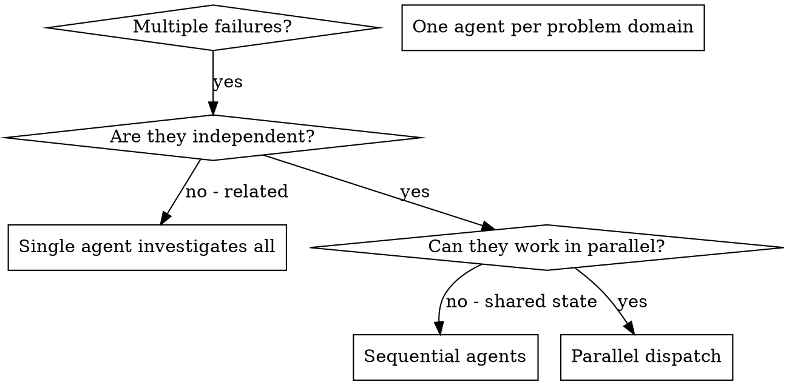

# Dispatching Parallel Agents

## Overview

You delegate tasks to specialized agents with isolated context. By precisely crafting their instructions and context, you ensure they stay focused and succeed at their task. They should never inherit your session's context or history — you construct exactly what they need. This also preserves your own context for coordination work.

When you have multiple unrelated failures (different test files, different subsystems, different bugs), investigating them sequentially wastes time. Each investigation is independent and can happen in parallel.

**Core principle:** Dispatch one agent per independent problem domain. Let them work concurrently.

## When to Use



**Use when:**
- 3+ test files failing with different root causes
- Multiple subsystems broken independently
- Each problem can be understood without context from others
- No shared state between investigations

**Don't use when:**
- Failures are related (fix one might fix others)
- Need to understand full system state
- Agents would interfere with each other

## The Pattern

### 1. Identify Independent Domains

Group failures by what's broken:
- File A tests: Tool approval flow
- File B tests: Batch completion behavior
- File C tests: Abort functionality

Each domain is independent - fixing tool approval doesn't affect abort tests.

### 2. Create Focused Agent Tasks

Each agent gets:
- **Specific scope:** One test file or subsystem
- **Clear goal:** Make these tests pass
- **Constraints:** Don't change other code
- **Expected output:** Summary of what you found and fixed

### 3. Dispatch in Parallel

Issue all three subagent dispatches in the same response — they run in parallel:

```text
Subagent (general-purpose): "Fix agent-tool-abort.test.ts failures"
Subagent (general-purpose): "Fix batch-completion-behavior.test.ts failures"
Subagent (general-purpose): "Fix tool-approval-race-conditions.test.ts failures"
# All three run concurrently.
```

Multiple dispatch calls in one response = parallel execution. One per response = sequential.

### 4. Review and Integrate

When agents return:
- Read each summary
- Verify fixes don't conflict
- Run full test suite
- Integrate all changes

## Agent Prompt Structure

Good agent prompts are:
1. **Focused** - One clear problem domain
2. **Self-contained** - All context needed to understand the problem
3. **Specific about output** - What should the agent return?

```markdown
Fix the 3 failing tests in src/agents/agent-tool-abort.test.ts:

1. "should abort tool with partial output capture" - expects 'interrupted at' in message
2. "should handle mixed completed and aborted tools" - fast tool aborted instead of completed
3. "should properly track pendingToolCount" - expects 3 results but gets 0

These are timing/race condition issues. Your task:

1. Read the test file and understand what each test verifies
2. Identify root cause - timing issues or actual bugs?
3. Fix by:
   - Replacing arbitrary timeouts with event-based waiting
   - Fixing bugs in abort implementation if found
   - Adjusting test expectations if testing changed behavior

Do NOT just increase timeouts - find the real issue.

Return: Summary of what you found and what you fixed.
```

## Common Mistakes

**❌ Too broad:** "Fix all the tests" - agent gets lost
**✅ Specific:** "Fix agent-tool-abort.test.ts" - focused scope

**❌ No context:** "Fix the race condition" - agent doesn't know where
**✅ Context:** Paste the error messages and test names

**❌ No constraints:** Agent might refactor everything
**✅ Constraints:** "Do NOT change production code" or "Fix tests only"

**❌ Vague output:** "Fix it" - you don't know what changed
**✅ Specific:** "Return summary of root cause and changes"

## When NOT to Use

**Related failures:** Fixing one might fix others - investigate together first
**Need full context:** Understanding requires seeing entire system
**Exploratory debugging:** You don't know what's broken yet
**Shared state:** Agents would interfere (editing same files, using same resources)

## Real Example from Session

**Scenario:** 6 test failures across 3 files after major refactoring

**Failures:**
- agent-tool-abort.test.ts: 3 failures (timing issues)
- batch-completion-behavior.test.ts: 2 failures (tools not executing)
- tool-approval-race-conditions.test.ts: 1 failure (execution count = 0)

**Decision:** Independent domains - abort logic separate from batch completion separate from race conditions

**Dispatch:**
```
Agent 1 → Fix agent-tool-abort.test.ts
Agent 2 → Fix batch-completion-behavior.test.ts
Agent 3 → Fix tool-approval-race-conditions.test.ts
```

**Results:**
- Agent 1: Replaced timeouts with event-based waiting
- Agent 2: Fixed event structure bug (threadId in wrong place)
- Agent 3: Added wait for async tool execution to complete

**Integration:** All fixes independent, no conflicts, full suite green

## Verification

After agents return:
1. **Review each summary** - Understand what changed
2. **Check for conflicts** - Did agents edit same code?
3. **Run full suite** - Verify all fixes work together
4. **Spot check** - Agents can make systematic errors

## Delivering Parallel Work (the bead-crunch pattern)

The pattern above shares one working tree — fine for a same-tree fix wave, wrong once the
independent items are substantial enough to need their own review and their own PR. When
you're clearing a batch of independent backlog items (bd issues, tickets, whatever the
project tracks), each one needs real delivery, not just integration back into your session.

1. **One worktree/branch per independent item.** Group entangled items — ones that would
   touch the same files or tests — into a single family sharing one branch; keep truly
   independent items on separate branches. Use using-git-worktrees for each.
2. **Work each branch to review-clean before moving to delivery.** Apply the same per-branch
   review discipline as a single task: a task review (spec compliance + code quality) with a
   fix loop, exactly as subagent-driven-development's Task Loop runs it — don't skip the loop
   just because the item is small. Then run a security pass — combined across the whole batch
   at the end, or per-branch as each one finishes, whichever fits the batch's size — per
   security-review.
3. **Accumulate, don't deliver one at a time.** As each branch goes review-clean, add it to a
   running list (worktree path, and the PR number if one already exists). Do not dispatch
   finishing-a-development-branch per branch as you go — that serializes CI waits across the
   whole batch for no reason.
4. **Dispatch ONE branch-shepherd with the full train** once the batch (or a convenient chunk
   of it) is accumulated. It pushes, opens PRs, waits out CI, handles CodeRabbit, reconciles
   conflicts if main moves mid-train, squash-merges, and cleans up worktrees — sequentially,
   across every branch in the list — and reports one outcome table.

### Scope batches by concept, not by ticket

Tickets are evidence that a concept is broken, rarely a complete description of it. A brief
that names a file, a screen, or a single UI element is surface-scoped; a concept-scoped brief
names the rule that should hold everywhere ("every affordance that reaches the daemon while
the daemon is absent"), with the tickets attached as examples.

In the brief, have the agent enumerate the surfaces the concept touches before implementing,
and state the correct behaviour at each — the agent has the code open and can bound the class
more cheaply than anyone later. Say explicitly: if you find instances the tickets do not
mention, fix them here and say so in your report — do not file them as new tickets. Without
that line a conscientious agent files rather than fixes, and one under-scoped dispatch grows
the backlog by several tickets that were really one.

File overlap (step 1) is orthogonal: concept scoping decides WHAT is in a batch; file overlap
decides WHICH batches can run concurrently.

### Choosing between this and subagent-driven-development

The deciding axis is dependency structure, not task count:

- **Tasks build on each other** (later work assumes earlier work's interfaces, files, or
  state) → subagent-driven-development. One branch, sequential dispatch, in-order review.
- **Items are independent** (no item's work depends on another's output) → this skill. Many
  branches, parallel dispatch, delivered as a train.

They compose: a planned epic's independent tasks can each be handed to a parallel-dispatch
batch, and within each batch item, subagent-driven-development's task-brief/implement/review
loop still governs how that one item gets built — parallelism picks the branch layout, SDD
still governs the work inside each branch.

### Escalating a hard call

Parallel dispatch produces the most cross-agent conflict of any workflow here — more agents,
less shared context, no sequential review to catch a disagreement early. When agents disagree,
do not settle it yourself in prose. You cannot reliably see what you are missing, and running
on a top-tier model does not change that.

The escalation triggers and the orchestrator-side dispatch instructions are stated once, in
/joe-bag-of-tricks:subagent-driven-development under **Escalation** — read them there. They
apply unchanged to this path, except trigger 3, whose bound is counted differently: here it
fires when **the same gate fails twice on one branch after a fix aimed at it**. The gates are
whatever the project commits to as its pre-commit and pre-PR bar — its test suite, its linters,
its schema or manifest validators, and CI.

Name the governing decisions at batch setup rather than per task, and carry the list into
every branch's dispatch. A batch touching one subsystem usually shares one list.

Dispatch `joe-bag-of-tricks:adjudicator` and record its ruling as a `bd note`
(`Ruling: <what> — <why> — <cost if wrong>`), the same as the SDD path. In a bead crunch the
roll-up at the end is the only place your human partner sees these, so an unrecorded ruling is
an invisible one.

Branch-vs-branch conflicts are NOT an escalation trigger — `branch-shepherd` reconciles those
during delivery.

## Integration

**Pairs with:**
- **subagent-driven-development** - Alternative for dependent tasks; composes with this skill
  for independent tasks inside a planned epic (see "Choosing between..." above)
- **using-git-worktrees** - One worktree/branch per independent item or entangled family
- **requesting-code-review** - Per-branch task review with fix loop before a branch counts as
  review-clean
- **security-review** - Security pass before delivery, combined or per-branch

**Dispatches:**
- **branch-shepherd** agent (sonnet) - Delivers the accumulated train of review-clean
  branches unattended (Delivering Parallel Work)
- **adjudicator** agent (fable) - One-shot ruling when an escalation trigger fires
  (Escalating a hard call)
