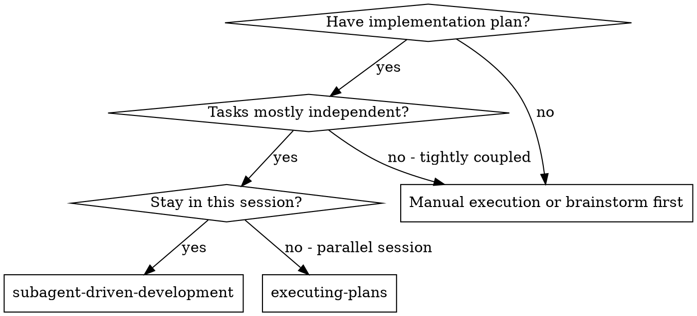
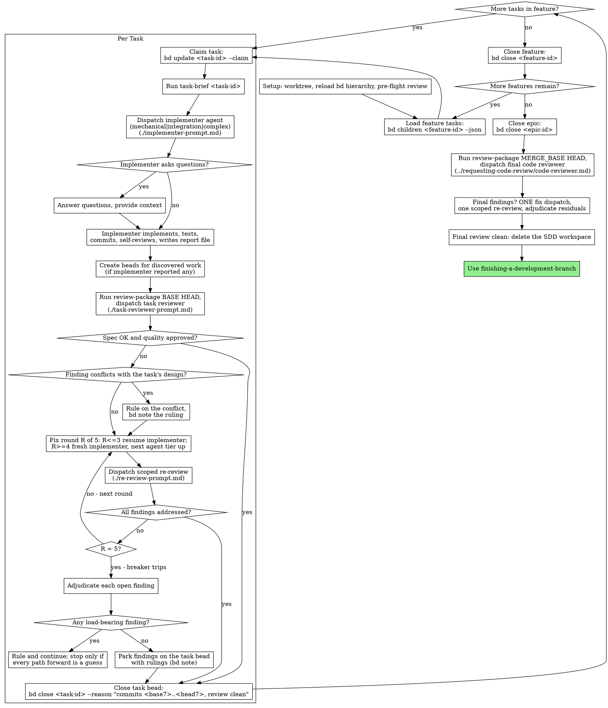

# Subagent-Driven Development

Execute plan by dispatching a fresh implementer subagent per task, a task review (spec compliance + code quality) after each, and a broad whole-branch review at the end.

**Why subagents:** You delegate tasks to specialized agents with isolated context. By precisely crafting their instructions and context, you ensure they stay focused and succeed at their task. They should never inherit your session's context or history — you construct exactly what they need. This also preserves your own context for coordination work.

**Core principle:** Fresh subagent per task + task review (spec + quality) + broad final review = high quality, fast iteration

**Narration:** between tool calls, narrate at most one short line — bd state and the tool results carry the record.

**Continuous execution:** Do not pause to check in with your human partner between tasks. Execute all tasks from the plan without stopping. The only reasons to stop are the four named below, or all tasks complete. "Should I continue?" prompts and progress summaries waste their time — they asked you to execute the plan, so execute it.

**Rulings, not stalls.** A running plan does not wait on a human. Conflicts,
ambiguities, plan defects, a cap you would have asked to exceed — decide
them. The spec is the binding authority, the plan is its argument, and your
judgment settles what neither answers. Record every decision as
`bd note <task-id> "Ruling: <what you decided> — <why> — <what it costs if
wrong>"` (epic-level rulings go on the epic), and keep going. A wrong ruling
costs rework your human partner can see and undo; a session parked on a
question costs their whole day and buys nothing.

Four things stop you, and only these: an irreversible or destructive
operation; a security-sensitive action; a side effect outside this worktree
that norms say you ask about first (a merge, a push to a shared branch, a
publish); and a plan so broken that every path forward is a guess. For those,
stop and ask.

## When to Use



**vs. Executing Plans (parallel session):**
- Same session (no context switch)
- Fresh subagent per task (no context pollution)
- Review after each task (spec compliance + code quality), broad review at the end
- Faster iteration (no human-in-loop between tasks)

## The Process



## Setup

Ensure the work happens in an isolated workspace: use using-git-worktrees to
create one or verify the existing one. Never start implementation on a
main/master branch without your human partner's explicit consent.

**Durable progress rides on bd, not a ledger file.** Conversation memory does
not survive compaction. In real sessions, controllers that lost their place
have re-dispatched entire completed task sequences — the single most expensive
failure observed. A separate ledger file would duplicate state a
beads-only-tracking project already tracks for free, and bd's globally unique
task IDs mean no two plans can ever collide over the same record.

- At skill start (and after any compaction), reload the hierarchy:
  `bd children <epic-id> --json` and, per feature, `bd children <feature-id>
  --json` (`bd children` includes closed issues by default). Tasks bd already
  shows `closed` are DONE — do not re-dispatch them; resume at the first task
  not `closed`. A task that is `in_progress` with fix-round notes is mid-loop:
  resume the loop at the next round.
- Every ruling, deferral, and fix round is a `bd note <task-id> "..."` — it
  appends to the task's notes without changing status. Closing carries the
  commit range as the reason. Those breadcrumbs name commits that exist in git
  even when your context no longer remembers creating them.
- After compaction, trust `bd show` / `bd children` and `git log` over your
  own recollection.
- The `.joe-bag-of-tricks/sdd/` workspace (briefs, reports, review packages)
  is disposable scratch, not the record — losing it (`git clean -fdx`
  included) costs nothing; bd and git are the only durable state.

### Pre-Flight Plan Review

Before claiming Task 1, scan the bd hierarchy once for conflicts. The bd
hierarchy IS the plan — there is no markdown plan file to read instead: walk
`bd children <epic-id> --json`, then `bd children <feature-id> --json` for
each feature, the same two-level traversal the process above uses.

The epic is the plan's argument for its spec: if `bd show <epic-id>` names a
spec (`--spec-id`, pointing at the living design doc), read that too —
conflicts inside the plan resolve against the epic's spec fields
(description/design) and that doc. An epic with no reachable spec gets a
`bd note` saying so — rulings made without one are provisional.

Scan for, writing down what you checked as you check it:

- tasks that contradict each other or the epic's Global Constraints
  (`bd show <epic-id>` — the design field set during writing-plans)
- anything a task's design explicitly mandates that the review rubric treats
  as a defect (a test that asserts nothing, verbatim duplication of a logic
  block)

The scan's output is a table, not a verdict. One row for every pair of tasks
that share a file or an interface: the two tasks, what one produces against
what the other consumes, and what you found. One row for every task: whether
its own text agrees with itself — the tests it specifies against the code it
specifies, the files it creates against the files it later touches. "The scan
is clean" without those rows is not a scan you ran.

Record the table as a `bd note` on the epic. Rule on everything you find
before execution begins — each finding against the task text that mandates
it, the spec as the binding authority — and record each ruling beside its
row. If the scan is clean, proceed without comment. The review loop remains
the net for conflicts that only emerge from implementation.

## Model Selection

Use the least powerful agent that can handle each role. Start cheap, escalate on failure.

Implementers dispatch as plugin **agent types** — each definition pins its own model and
reasoning effort, so the dispatch names an agent and passes no model. Reviewers dispatch as
general-purpose subagents with an explicit `model` param, drawn from
`"haiku" | "sonnet" | "opus"`. That is the reviewer tier list, not the Agent tool's full
set — the session's roster may offer higher tiers. The adjudicator dispatches as an agent
type like the implementers do, so it pins its own model and takes no model param. Use this
table:

| Role | Dispatch as | Why |
|------|-------------|-----|
| Implementer (mechanical) | `joe-bag-of-tricks:implementer-mechanical` (haiku, low effort) | Clear spec, 1-2 files, plan provides code snippets. Review stage catches mistakes. |
| Implementer (integration) | `joe-bag-of-tricks:implementer` (sonnet, medium effort) | Multi-file coordination, message passing, pattern matching. |
| Implementer (complex) | `joe-bag-of-tricks:implementer-complex` (opus, high effort) | Design judgment, broad codebase understanding, architectural decisions. |
| Task reviewer (spec + quality) | `model: "sonnet"` | One dispatch covers both a structured spec comparison and a judgment-heavy quality read. Escalate to `opus` for a subtle or high-risk diff (see Review tasks below) — never drop to `haiku`: it caught 0/10 planted defects in upstream's own evaluation and rationalized them away. |
| Scoped re-reviewer | `model: "haiku"` or `"sonnet"` | Verifying a small fix diff against a fixed findings list. Match the tier to the fix diff's size and risk. |
| Final reviewer | `model: "fable"` (top tier; if Fable is not in this session's roster, use the top tier that is) | Holistic assessment across the entire branch. |

**Most implementation tasks are mechanical when the plan is well-specified.** Plans from writing-plans include code snippets, file paths, and acceptance criteria — enough context for `implementer-mechanical` to succeed.

**Turn count beats token price.** Wall-clock and context cost scale with how many turns a subagent takes, and the cheapest models routinely take 2-3× the turns on multi-step work — costing more overall. Use `sonnet` as the floor for reviewers, and `implementer` as the floor for implementers working from prose descriptions. When the task's plan text contains the complete code to write, the implementation is transcription plus testing: dispatch `implementer-mechanical` for that task. Single-file mechanical fixes also take the cheapest tier.

**Complexity signals for implementers:**
- Touches 1-2 files with a complete spec → `implementer-mechanical`
- Touches multiple files with integration concerns → `implementer`
- Requires design judgment or broad codebase understanding → `implementer-complex`

**Review tasks:** choose the model with the same judgment, scaled to the diff's size, complexity, and risk. A small mechanical diff does not need `opus`; a subtle concurrency change does — escalate the task reviewer to `opus` for those.

**Fix-loop escalation (rounds 4-5):** re-dispatch one step up the implementer
ladder (`implementer-mechanical` → `implementer` → `implementer-complex`) from
the agent that got stuck. The ladder tops out at `implementer-complex`.

**Escalation is the safety net:** If `implementer-mechanical` reports BLOCKED, re-dispatch `implementer`. If `implementer` reports BLOCKED, re-dispatch `implementer-complex`. Never retry the same agent type without changing something (see step 2 below).

**Always name the agent type or the model explicitly when dispatching.** An implementer dispatch names its agent type, which carries the model and effort with it. A reviewer dispatch names its model, and an omitted model inherits your session's model — often the most capable and most expensive — which silently defeats this section.

**Escalation.** You cannot reliably see what you are missing. That is a property of models,
not of tiers -- an orchestrator on the top tier is as blind to its own gaps as one on a
mid-tier model, so never escalate because a call *feels* hard. Escalate when one of these
fires, each detectable by counting or comparing:

| # | Fires when |
|---|---|
| 1 | Two agents flatly contradict each other on a fact |
| 2 | An agent's output conflicts with a named governing decision |
| 3 | The fix-loop breaker trips -- round 5 with findings still open |
| 4 | A Critical finding touches data loss, security, or user files |

**Name the governing decisions up front.** Trigger 2 is checked against a list you state in
the task brief: the task's own design, plus whichever recorded decisions bear on the work.
Decisions recorded during the run join the list as they are written. Checking against every
doc in the project instead is a scan you will silently skip, which defeats the trigger.

When several triggers fire at once, that is still ONE dispatch -- one question packet naming
every fired trigger. Dispatch `joe-bag-of-tricks:adjudicator`, passing the artifact file
paths, the governing-decision paths, and the narrow question. It pins its own model; pass no
model param. Never dispatch it as a fork -- a fork inherits your whole session.

Record the ruling as a `bd note` (`Ruling: <what> -- <why> -- <cost if wrong>`). The ruling
stands, the run continues, and it surfaces in the "Rulings I made" roll-up at Finish -- your
human partner audits after, not during. Only the four stop classes interrupt the run.

## The Task Loop

**Batch small same-shape work.** When the plan lists several tasks that are
each a small, independent edit of the same kind — the same one-line fix,
constant change, or field addition repeated across files — do not dispatch
one subagent per task. Compose ONE dispatch brief listing every file and
its change, send the whole batch to a single subagent, and review its diff
as one unit. Reserve one-dispatch-per-task for work that needs its own
judgment, its own tests, or its own review surface.

Everything you paste into a dispatch prompt — and everything a subagent
prints back — stays resident in your context for the rest of the session
and is re-read on every later turn. Hand artifacts over as files. The same
goes for command output you'll consult more than once: capture the test
suite's output to a scratch file and re-grep the file — re-running the
suite to re-read its output pays the wall-clock cost again for nothing.

**Waiting on dispatched subagents:** never poll a wait interface with
short timeouts, and never sit in one silent, open-ended wait either.
While you have local work — bd notes, packaging the next review,
reading reports — keep working; child results arrive on their own.
When you are genuinely idle, wait in bounded stretches (five to ten
minutes, where your platform allows), and between stretches post one
line of status and reconcile your live children: list them, and chase
any that finished without reporting. A bounded stretch keeps nearly
all of a long wait's efficiency while guaranteeing a stuck or lost
child is noticed within minutes, not at the end of the session.

### 1. Dispatch the implementer

Claim the task (`bd update <task-id> --claim`) and record BASE
(`git rev-parse HEAD`) before dispatching — the review package and fix-round
diffs need it.

- **Task brief:** run this skill's `scripts/task-brief <task-id>` — it reads
  the task straight out of bd (`bd show <task-id> --json`: title, description,
  design, notes) into a uniquely named file and prints the path. Compose the
  dispatch so the brief stays the single source of requirements. Your dispatch
  should contain: (1) one line on where this task fits in the project; (2) the
  brief path, introduced as "read this first — it is your requirements, with
  the exact values to use verbatim"; (3) interfaces and decisions from earlier
  tasks that the brief cannot know; (4) your resolution of any ambiguity you
  noticed in the brief; (5) the report-file path and report contract. Exact
  values (numbers, magic strings, signatures, test cases) appear only in the
  brief. Never make a subagent read bd issues directly.
- **Report file:** name the implementer's report file after the brief
  (brief `…/task-<task-id>-brief.md` → report `…/task-<task-id>-report.md`)
  and put it in the dispatch prompt. The implementer writes the full report
  there and returns only status, commits, a one-line test summary, and
  concerns.
- A dispatch prompt describes one task, not the session's history. Do not
  paste accumulated prior-task summaries ("state after Tasks 1-3") into
  later dispatches — a real session's dispatch hit 42k chars of which 99%
  was pasted history. A fresh subagent needs its task, the interfaces it
  touches, and the global constraints. Nothing else.
- The dispatch carries the no-subagents contract (it is in the
  implementer template): the implementer never dispatches subagents —
  not helpers, and never a reviewer. Review arrives from you, after the
  report. In real sessions, every reviewer a worker spawned duplicated
  the task review the controller dispatched anyway — a full extra
  review seat per task.
- If an earlier task parked a finding in the area this task touches, carry a
  pointer to that task's bead in the dispatch.
- Record the implementer's agent identity from the dispatch result —
  fix-loop rounds 1-3 resume this agent.
- Never dispatch multiple implementation subagents in parallel (conflicts).
- Subagents never create or close bd issues, push to a remote, or create PRs.
  You manage all of those.

Template: [implementer-prompt.md](implementer-prompt.md)

### 2. Handle the report

Implementer subagents report one of four statuses. Handle each appropriately:

**DONE:** Generate the review package (`scripts/review-package BASE HEAD`, from this skill's directory — it prints the unique file path it wrote; BASE is the commit you recorded before dispatching the implementer — never `HEAD~1`, which silently drops all but the last commit of a multi-commit task), then dispatch the task reviewer with the printed path.

**DONE_WITH_CONCERNS:** The implementer completed the work but flagged doubts. Read the concerns before proceeding. If the concerns are about correctness or scope, address them before review. If they're observations (e.g., "this file is getting large"), note them and proceed to review.

**NEEDS_CONTEXT:** The implementer needs information that wasn't provided. Provide the missing context and re-dispatch.

**BLOCKED:** The implementer cannot complete the task. Assess the blocker:
1. If it's a context problem, provide more context and re-dispatch the same agent type
2. If the task requires more reasoning, re-dispatch one step up the implementer
   ladder (`implementer-mechanical` → `implementer` → `implementer-complex`)
3. If the task is too large, break it into smaller pieces
4. If the plan itself is wrong, rule on the correction, record it
   (`bd note <task-id> "Ruling: ..."`), and re-dispatch with the ruling
   carried in the dispatch

**Never** ignore an escalation or force the same agent type to retry without changes. If the implementer said it's stuck, something needs to change.

If the implementer asks questions — before starting or mid-task — answer
clearly and completely, provide additional context if needed, and don't rush
it into implementation.

If the implementer reported discovered work, create a bead for it now:
`bd create --title="..." --type=task --priority=2 --deps discovered-from:<task-id>`.
Ignoring discovered work is a silent discard.

### 3. Review the task

Per-task reviews are task-scoped gates. The broad review happens once, at the
final whole-branch review. Never skip the task review, and never accept a
report missing either verdict — spec compliance AND task quality are both
required. Implementer self-review never replaces the task review; both are
needed.

- Hand the reviewer its diff as a file: run this skill's
  `scripts/review-package BASE HEAD` and pass the reviewer the file path
  it prints (or, without bash: `git log --oneline`, `git diff --stat`,
  and `git diff -U10` for the range, redirected to one uniquely named
  file). The output never enters your own context, and the reviewer sees
  the commit list, stat summary, and full diff with context in one Read
  call. Use the BASE you recorded before dispatching the implementer —
  never `HEAD~1`, which silently truncates multi-commit tasks. Never
  dispatch a task reviewer without a diff file.
- **Reviewer inputs:** the task reviewer gets three paths — the same brief
  file, the report file, and the review package — plus the global
  constraints that bind the task.
- **Reviewer return contract:** the reviewer writes its FULL report to a
  file (brief `…-brief.md` → review `…-review.md`) and returns only the two
  verdicts plus Critical/Important findings as one-liners (≤15 lines).
  Reviewer prose returned inline is permanently resident in the controller's
  context and re-read every turn after — across a multi-task epic that is
  thousands of tokens of pure bloat. The findings list must still be
  complete enough to run the fix loop without opening the file.
- The global-constraints block you hand the reviewer is its attention
  lens. Copy the binding requirements verbatim from the epic's Global
  Constraints (`bd show <epic-id>` — the design field set during
  writing-plans) or the spec: exact values, exact formats, and the stated
  relationships between components ("same layout as X", "matches Y"). The
  reviewer's template already carries the process rules (YAGNI, test
  hygiene, review method) — the constraints block is for what THIS
  project's spec demands.
- Do not add open-ended directives like "check all uses" or "run race tests
  if useful" without a concrete, task-specific reason
- Do not ask a reviewer to re-run tests the implementer already ran on the
  same code — the implementer's report carries the test evidence
- Do not pre-judge findings for the reviewer — never instruct a reviewer to
  ignore or not flag a specific issue. If you believe a finding would be a
  false positive, let the reviewer raise it and adjudicate it in the review
  loop. If the prompt you are writing contains "do not flag," "don't treat X
  as a defect," "at most Minor," or "the plan chose" — stop: you are
  pre-judging, usually to spare yourself a review loop.

The task reviewer may report "⚠️ Cannot verify from diff" items — requirements
that live in unchanged code or span tasks. These do not block the rest of the
review, but you must resolve each one yourself before closing the task: you
hold the plan and cross-task context the reviewer lacks. If you confirm an
item is a real gap, treat it as a failed spec review — it enters the fix loop
with the other findings.

Template: [task-reviewer-prompt.md](task-reviewer-prompt.md)

### 4. The fix loop

The loop triggers when the review reports spec ❌, any Critical or Important
finding, or a ⚠️ item you confirmed as a real gap.

Before the loop starts, two routes leave it immediately:

- Record Minor findings on the task bead as you go
  (`bd note <task-id> "Minor (deferred): <one-liner>"`), and point the final
  whole-branch review at the closed tasks under the epic (`bd show <task-id>`)
  so it can triage which must be fixed before merge. A roll-up nobody reads is
  a silent discard. Minor findings never enter the loop.
- A finding labeled plan-mandated — or any finding that conflicts with what
  the task's design requires — is yours to rule on: weigh the finding
  against the task text, decide with the spec as the binding authority (via
  the adjudicator dispatch when a structural trigger fires — see Model
  Selection), and record the ruling as a `bd note` before you act on it. Do
  not dismiss the finding because the plan mandates it, and do not dispatch
  a fix that contradicts the plan without a recorded ruling.

Everything else enters the loop. A fix round is one fix dispatch plus one
scoped re-review. Five rounds maximum per task:

**Rounds 1-3 — resume the original implementer.** Send it the open findings
verbatim. Its context is intact: it knows the task, the code, and its own
choices. If you cannot send another message to the live subagent, dispatch a
fresh implementer carrying the brief path, the report-file path, and the
findings — the report file is the persistent memory either way.

**Never dispatch a fork for a fix round.** A fork inherits the controller's
entire session context and runs on the controller's model — the most
expensive possible dispatch for what is usually the smallest diff of the
task. A real session paid ~250k tokens forking a 2-line fix that a resumed
implementer or a fresh cheap-tier dispatch would have done for ~5k. Resume
the implementer; when that's impossible, a fresh implementer with the brief
and report paths is the fallback — never a fork.

**Rounds 4-5 — dispatch a fresh implementer one step up the agent ladder** (per
Model Selection), with the brief path, the report-file path, the open
findings, and this framing: "A prior implementer attempted this task
[N] times; you own it now. Read the report file for what was tried." A loop
that survives three resumes usually means the implementer cannot see its
own problem — fresh eyes and a capability bump in one move.

**Every round, either way:** the implementer fixes, re-runs the tests
covering the amended code, appends its fix report to the same report file,
and returns the short contract. Before re-dispatching the reviewer, confirm
the fix report contains the covering tests, the command run, and the
output; dispatch the re-review once all three are present. Name the
covering test files in the fix message — a one-line fix does not need the
whole suite.

**The re-review is scoped.** Run `scripts/review-package FIX_BASE HEAD`
where FIX_BASE is the head the previous review saw, and dispatch
[re-review-prompt.md](re-review-prompt.md) with the findings list, the
brief, the report file, and the printed diff path. The re-reviewer verdicts
each finding ADDRESSED or NOT ADDRESSED and flags new breakage in the fix
diff only. New Critical/Important breakage in the fix diff joins the open
findings list. Out-of-scope observations go to the task bead as deferred
minors — they never extend the loop.

**After each round,** append to the task bead:
`bd note <task-id> "Fix round <R>/5: <X> addressed, <Y> open — <finding one-liners>; commits <a7>..<b7>"`

Never fix findings yourself in the controller session — your context stays
clean for coordination, and controller fixes skip review.

**The breaker.** When round 5's re-review still leaves findings open, stop
dispatching. Adjudicate each open finding yourself — you hold the plan and
the cross-task context the reviewer lacks:

- **The reviewer is wrong, or the point is contestable:** park it —
  `bd note <task-id> "Parked: <finding> — Ruling: <why the code stands>"`.
  The final review sees both sides.
- **Real, but nothing downstream builds on it:** park it the same way, with
  a ruling that says it's real and deferred.
- **Real and load-bearing** — a later task builds on it, or it reveals a
  plan defect: rule on the smallest change that unblocks the dependent work,
  record it (`bd note <task-id> "Ruling: <finding> — <what you decided and
  why>"`), and carry it into the next task's dispatch. Parking a structural
  failure silently lets every dependent task build on it. Stop only when the
  defect leaves every path forward a guess.

Adjudicate only at the cap. Adjudicating earlier to end a loop is
pre-judging with a different name. Every adjudication is a `bd note` — a
silent discard is forbidden.

### 5. Complete the task

When the review comes back clean — or every open finding is parked with a
ruling at the cap — close the task bead with the commit range as the reason:

- `bd close <task-id> --reason "commits <base7>..<head7>, review clean"`
- `bd close <task-id> --reason "commits <base7>..<head7>, <K> parked"` after
  a tripped breaker

Never close a task before the reviewer's report shows spec ✅ (or every ⚠️
resolved) and task quality Approved. Never move to the next task while the
review has open Critical/Important issues that are neither fixed nor
parked-with-ruling at the cap.

### 6. Roll up the hierarchy

When every task bead under a feature is closed, close the feature
(`bd close <feature-id> --reason "All tasks complete"`); when every feature is
closed, close the epic. Verify the children are actually closed first —
closing a parent over an open child hides unfinished work.

## Final Review

The final whole-branch review gets a package too: run
`scripts/review-package MERGE_BASE HEAD` (MERGE_BASE = the commit the branch
started from, e.g. `git merge-base main HEAD`) and include the printed path in
the final review dispatch, so the final reviewer reads one file instead of
re-deriving the branch diff with git commands. Dispatch on `model: "fable"` (top tier; if Fable
is not in this session's roster, use the top tier that is) using
requesting-code-review's
[code-reviewer.md](../requesting-code-review/code-reviewer.md). Point it at
the deferred-minor and parked notes on the epic's closed tasks so it can
triage which must be fixed before merge.

If the final whole-branch review returns findings, dispatch ONE fix subagent
with the complete findings list — not one fixer per finding. Per-finding
fixers each rebuild context and re-run suites; a real session's final-review
fix wave cost more than all its tasks combined. Then run exactly one scoped
re-review of the fix wave (`scripts/review-package FIX_BASE HEAD`,
[re-review-prompt.md](re-review-prompt.md)). Adjudicate any residual findings
as in the task loop's breaker: park with rulings on the relevant beads, or
rule on the load-bearing ones and record what you decided. Only the four stop
classes above stop you here. There is no second fix wave — residual
load-bearing findings surface to your human partner when finishing-a-development-branch
presents the options.

## Finish

Before you delete anything, collect every ruling from bd — preflight rulings,
parked findings, breaker and adjudicator rulings, all of them: walk the
epic's hierarchy and grep the notes for `Ruling:` (`bd show` each closed
task, or `bd children <epic-id> --json` and read the notes fields) — into
your final message under "Rulings I made", in the order you made them, each
with what it costs if wrong. The list is exhaustive: if a bd note holds a
ruling, the list holds it. **Design/plan-conflict rulings lead the list,
individually flagged** — each with the finding, the plan text it collided
with, and which you ruled governs. Those are the rulings your human partner
most needs to see: they overrode plan text on their behalf, and the summary
is where they understand what shifted and direct changes or rework. A ruling
left only in a bead was a decision made in secret.

When the final whole-branch review is clean and its fixes are merged, delete
the SDD workspace (`rm -rf "$(git rev-parse --show-toplevel)/.joe-bag-of-tricks/sdd"`)
— bd and git history are the record now.

Dispatch the `joe-bag-of-tricks:branch-shepherd` agent with this one branch (its worktree path,
and the PR number if one already exists) to run finishing-a-development-branch's tail —
push, PR, CI, CodeRabbit, squash-merge, cleanup — unattended, rather than conducting it
yourself step by step. **Dispatch it in the background** and keep working while it runs; it
reports back one outcome line for the branch.

For interactive, step-by-step delivery instead — watching each stage and deciding as you go —
use finishing-a-development-branch directly; its procedure is what branch-shepherd runs on
your behalf.

## Common Rationalizations

| Excuse | Reality |
|--------|---------|
| "Close enough on spec compliance" | Reviewer found spec gaps = not done. Fix or hit the cap and adjudicate — those are the only exits. |
| "I'll fix it myself, dispatching is overhead" | Controller fixes pollute your context and skip review. Resume the implementer. |
| "One more round will converge" | Past the cap, rounds don't converge — the failure is structural. Adjudicate and route. |
| "The reviewer will just find something new anyway" | Scoped re-reviews verify fixes; they cannot wander. New findings on untouched code go to the task bead, not the loop. |
| "This finding is obviously wrong, I'll drop it" | You adjudicate only at the cap, and every ruling is a `bd note`. Silent discards are forbidden. |
| "The fix was small, skip the re-review" | Unreviewed fixes are how regressions land. Every round ends with a scoped re-review. |
| "Reviews slow the loop down" | The loop without reviews is just unverified churn. Reviews are the loop's brakes and steering. |
| "I'll track progress in my head, bd is bookkeeping" | bd is what survives compaction. Controllers without it have re-dispatched entire completed task sequences. |
| "The subagent can close its own bead" | Subagents never touch bd, remotes, or PRs. You own all durable state. |
| "That discovered issue is out of scope, skip it" | File it: `bd create ... --deps discovered-from:<task-id>`. Unfiled discoveries are lost. |
| "A fork is the safest resume — it has all the context" | That's why it's the most expensive dispatch possible. A fix round needs the brief, the report, and the findings — not your whole session. Resume or go cheap. |
| "Inline reviewer reports are easier to adjudicate" | You adjudicate from the findings list. The full report belongs in a file — inline prose taxes every turn for the rest of the session. |
| "This decision feels hard, I should handle it carefully myself" | Feeling hard IS the trigger signal you can't trust. Check the structural triggers; if one fires, dispatch an adjudicator. |
| "The implementer spawned its own reviewer — free extra assurance" | It's a duplicate seat reviewing the same diff; the task review is the gate. A worker-spawned reviewer is a defect to flag, not rigor. |
| "This needs a human — I'll park the run and wait" | Only the four stop classes stop you. Everything else is a ruling: decide, bd note it, keep going. The roll-up at Finish is where it reaches them. |

## Example Workflow

```
You: I'm using Subagent-Driven Development to execute this plan.

[Setup: worktree verified]
[Load epic features: bd children <epic-id> --json — none closed, fresh start]

--- Feature 1 (bd-feat1): Hook system ---

[Load feature tasks: bd children bd-feat1 --json]

Task 1 (bd-abc): Hook installation script
  Complexity: 1-2 files, clear spec with code snippets → implementer-mechanical

[bd update bd-abc --claim; record BASE]
[Run scripts/task-brief bd-abc; prints .../task-bd-abc-brief.md]
[Dispatch joe-bag-of-tricks:implementer-mechanical with brief path + report path + context]

Implementer: "Before I begin - should the hook be installed at user or system level?"

You: "User level (~/.local/share/my-app/hooks/)"

Implementer: [Later]
  - Implemented install-hook command
  - Added tests, 5/5 passing
  - Self-review: Found I missed --force flag, added it
  - Committed
  - Wrote full report to .../task-bd-abc-report.md; returned a <15-line status summary

[Run scripts/review-package BASE HEAD; dispatch task reviewer (model: sonnet)
 with the brief, report, and diff-package paths]
Task reviewer: Spec ✅ - all requirements met, nothing extra.
  Strengths: Good test coverage, clean. Issues: None. Task quality: Approved.

[bd close bd-abc --reason "commits abc123f..def456a, review clean"]

Task 2 (bd-def): Recovery modes
  Complexity: multi-file, integration with hook system → implementer

[bd update bd-def --claim; task-brief; dispatch joe-bag-of-tricks:implementer]
Implementer: reports DONE, discovered work: "Found edge case in error path"
[bd create --title="Edge case in error path" ... --deps discovered-from:bd-def]
[Run review-package BASE HEAD; dispatch task reviewer (model: sonnet)]
Task reviewer: Spec ❌:
  - Missing: Progress reporting (spec says "report every 100 items")
  Issues (Important): Magic number (100)

[Fix round 1: resume the implementer with both findings]
Implementer: Added progress reporting, extracted PROGRESS_INTERVAL constant.
  Re-ran test/recovery.test.js — 10/10 passing. Fix report appended.

[Run review-package FIX_BASE HEAD; dispatch scoped re-review (model: haiku)]
Re-reviewer: Missing progress reporting — ADDRESSED (src/recovery.js:41).
  Magic number — ADDRESSED (src/recovery.js:7). New breakage: none.
  Verdict: all findings addressed.

[bd note bd-def "Fix round 1/5: 2 addressed, 0 open; commits d4e5f6a..b7c8d9e"]
[bd close bd-def --reason "commits ghi789b..jkl012c, review clean"]

[All tasks in feature closed — bd close bd-feat1 --reason "All tasks complete"]

--- Feature 2 (bd-feat2): Verification ---
...
[All features closed — bd close <epic-id> --reason "All features complete"]

[Run scripts/review-package MERGE_BASE HEAD; dispatch final code reviewer
 (model: fable; top-available-tier fallback if not in roster) with the printed path —
 requesting-code-review's code-reviewer.md]
Final reviewer: All requirements met. Deferred minors triaged: none block merge.

[Delete the SDD workspace — the record now lives in bd and git]

Done! Using finishing-a-development-branch.
```

## Integration

**Required workflow skills:**
- **using-git-worktrees** - REQUIRED: Set up isolated workspace before starting
- **writing-plans** - Creates the bd task hierarchy this skill executes
- **requesting-code-review** - Code review template for the final whole-branch review
- **finishing-a-development-branch** - Reference procedure for delivery; run directly for
  interactive delivery, or unattended via branch-shepherd (see Dispatches)

**Subagents should use:**
- **test-driven-development** - Subagents follow TDD for each task

**Dispatches:**
- **implementer-mechanical** / **implementer** / **implementer-complex** agents (haiku /
  sonnet / opus) - One per task, chosen per Model Selection; also the fix-loop and BLOCKED
  escalation ladder
- **branch-shepherd** agent (sonnet) - Runs the finishing-a-development-branch tail
  unattended for the finished branch (Finish)
- **adjudicator** agent (fable) - One-shot ruling when an escalation trigger fires (Escalation)

**Alternative workflow:**
- **executing-plans** - Use for parallel session instead of same-session execution
- **dispatching-parallel-agents** - Compose with this skill when an epic's independent tasks
  run inside a parallel batch: each parallel item can itself be an SDD task-brief
