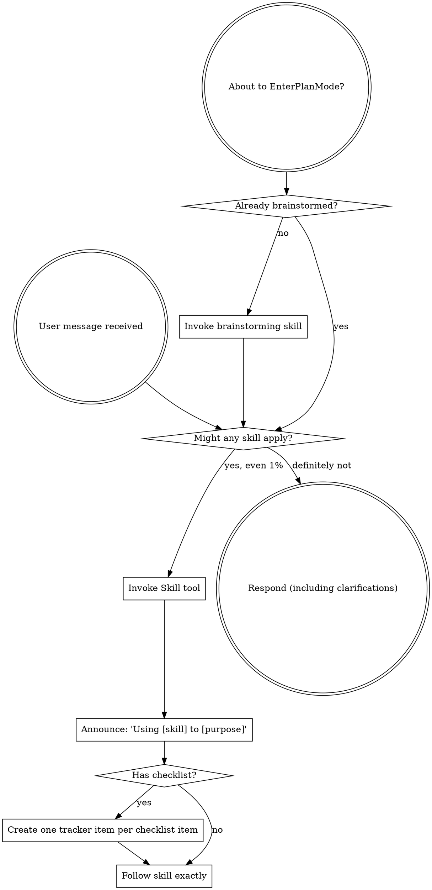

<SUBAGENT-STOP>
If you were dispatched as a subagent to execute a specific task, skip this skill.
</SUBAGENT-STOP>

Invoke a skill whenever there is even a small chance it applies, before responding or acting.
Skills carry procedures this project has tested; loading one that turns out not to fit costs
a tool call, while skipping one that did fit costs the work it would have prevented.

## Instruction Priority

Skills override default system prompt behavior, but **user instructions always take precedence**:

1. **User's explicit instructions** (CLAUDE.md, AGENTS.md, direct requests) — highest priority
2. **Skills** — override default system behavior where they conflict
3. **Default system prompt** — lowest priority

If CLAUDE.md or AGENTS.md says "don't use TDD" and a skill says "always use TDD," follow the user's instructions. The user is in control.

A skill that directs a subagent dispatch carries the user's authorization for it — orchestration-tool opt-in caveats (Workflow) govern those tools, not skill-directed Agent dispatches.

## How to Access Skills

Use the `Skill` tool. When you invoke a skill, its content is loaded and presented to you—follow it directly. Never use the Read tool on skill files.

# Using Skills

## The Rule

**Invoke relevant or requested skills before any response or action.** If an invoked skill turns out to be wrong for the situation, you don't need to use it.

## Red Flags

The skill check comes before exploring the codebase, before clarifying questions, and before
"just one quick thing" — those are the three places it gets skipped. A task feeling simple or
familiar is not evidence a skill doesn't apply, and remembering a skill is not the same as
loading its current version.

## Skill Priority

When multiple skills could apply, use this order:

1. **Process skills first** (brainstorming, debugging) - these determine HOW to approach the task
2. **Implementation skills second** (frontend-design, mcp-builder) - these guide execution

"Let's build X" → brainstorming first, then implementation skills.
"Fix this bug" → debugging first, then domain-specific skills.

## Skill Types

**Rigid** (TDD, debugging): Follow exactly. Don't adapt away discipline.

**Flexible** (patterns): Adapt principles to context.

The skill itself tells you which.

## User Instructions

Instructions say WHAT, not HOW. "Add X" or "Fix Y" doesn't mean skip workflows.
